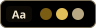
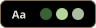
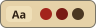
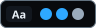

# ThemeForge

A drop-in theme for web apps, made to be added by an AI coding agent in one step: ten colour
themes with a picker, design tokens, a base element layer, text standards and ready-made
component classes. Plain CSS and a small script in one folder, `ui-theme/`. No build step,
no dependencies, any framework.


See every component in every theme in [`specimen/index.html`](specimen/index.html) (serve the
repository with `python3 -m http.server` and open `/specimen/`).

**Using an AI agent?** Point it at [`AGENTS.md`](AGENTS.md): "Add ThemeForge to this app
following AGENTS.md in https://github.com/LaserLloyd/ThemeForge".

## Quick start

<!-- install:start -->
Run from the app's root folder (Python 3.9 or newer; change `static/ui-theme` to the folder
you chose):

```
python3 -c "import urllib.request as u,sys;sys.argv=['update.py','--dest','static/ui-theme'];exec(u.urlopen('https://raw.githubusercontent.com/LaserLloyd/ThemeForge/main/ui-theme/update.py').read())"
```

On Windows use `python` (or `py`) instead of `python3`; the line is the same in PowerShell,
cmd and bash. It downloads the installer, which fetches the latest release from GitHub,
checks every file against its checksum list and writes the folder. Later updates are
`python3 static/ui-theme/update.py`. Offline: download a release archive (`.tar.gz`) elsewhere,
then run `python3 update.py --source <archive> --dest static/ui-theme` with the `update.py` from
its `ui-theme/` folder.
<!-- install:end -->

Then, in every page's `<head>`:

```html
<script src="/static/ui-theme/ui-theme.js"
        data-themes="purple,midnight-gold,glacier,forest,paper,daylight"
        data-default="auto" data-default-dark="midnight-gold" data-default-light="daylight"
        data-storage-key="myapp.theme"></script>
<link rel="stylesheet" href="/static/ui-theme/ui-theme-base.css">
<link rel="stylesheet" href="/static/ui-theme/ui-components.css">
<!-- your stylesheets -->
<link rel="stylesheet" href="/static/ui-theme/ui-theme.css">
```

and a picker wherever you like: `<select data-ui-theme-picker aria-label="Theme"></select>`.
Build with tokens (`var(--surface-2)`, `var(--text-secondary)`) and classes
(`ui-btn ui-btn--primary`, `ui-card`, `ui-switch`). Full guide: [`AGENTS.md`](AGENTS.md).

Works in current Chrome, Edge, Firefox and Safari (2024 or newer).

Prefer not to install anything? For a prototype, load the files from jsDelivr:
`https://cdn.jsdelivr.net/gh/LaserLloyd/ThemeForge@v1.0.0/ui-theme/ui-theme.js` (and the
same path for each CSS file).

## Themes

| | Theme | Kind | |
|---|---|---|---|
|  | Purple | dark | Violet accent and soft lavender text on deep indigo. The base theme. |
|  | Midnight Gold | OLED | Warm gold on true black. |
|  | Glacier | OLED | Ice-blue text on true black with a deep teal accent. |
|  | Forest | OLED | Pale sage and lichen with bark browns on true black. |
|  | Paper | light | Warm parchment, ink-brown text, a serif for prose. |
|  | Daylight | light | Clean white with a blue accent. |
|  | Electric Yellow | dark, opt-in | Acid yellow on graphite. |
|  | LaserLloyd | dark, opt-in | Laser blue on graphite; pairs with LaserLloyd Light. |
|  | LaserLloyd Light | light, opt-in | The light partner of LaserLloyd. |
|  | Night Red | OLED, opt-in | Low blue light: ember text on black, zero blue in any colour. |

The first six are the core set an app offers by default; the opt-in four appear only when an
app lists them. Every theme passes a contrast audit
([`docs/contrast-report.md`](docs/contrast-report.md)): body text at 7:1, secondary text at
4.5:1 on every surface, control edges and on/off states at 3:1. On, selected and disabled
states read by shape as well as colour in every theme. More in
[`docs/THEMES.md`](docs/THEMES.md), including how to add your own theme.

## What is in the folder

| File | |
|---|---|
| `ui-theme.js` | the runtime: applies the saved theme before first paint, follows the OS light/dark setting with `data-default="auto"`, fills pickers, syncs tabs, exposes `window.UITheme` |
| `ui-theme-base.css` | element defaults, focus ring, scrollbars, reduced motion, text tiers, `.ui-markdown`, highlight.js colours |
| `ui-components.css` | buttons, fields, checkboxes, radios, switches, cards, badges, callouts, tabs, segmented controls, tables, dialogs, menus, tooltips, toasts, progress, code blocks, an app shell |
| `ui-theme.css` | the tokens of all ten themes (about 20 KB gzipped) |
| `ui-components.js` | optional themed `confirm()`, `alert()`, `prompt()` and toasts |
| `adapters/` | NiceGUI/Quasar, Tailwind CSS v4 and v3 |
| `update.py` | installs and updates the folder, checking every file |
| `ui-theme.d.ts` | TypeScript declarations for `window.UITheme` and `window.UIComponents` |
| `themes.json`, `VERSION`, `files.json`, `README.md` | the theme list, version, checksums, and usage notes |

## Documentation

- [`AGENTS.md`](AGENTS.md): add the theme to an app, step by step (for agents and people)
- [`docs/TOKENS.md`](docs/TOKENS.md): every token, by group
- [`docs/COMPONENTS.md`](docs/COMPONENTS.md): every component class, with markup
- [`docs/TEXT.md`](docs/TEXT.md): text tiers and the markdown style
- [`docs/THEMES.md`](docs/THEMES.md): the themes, their design notes, and adding a theme
- [`docs/INTEGRATIONS.md`](docs/INTEGRATIONS.md): Flask, FastAPI, Django, Vite, React/Next.js, Vue, Svelte, NiceGUI, Tailwind, Electron
- [`docs/UPDATING.md`](docs/UPDATING.md): updates, pinning, caching, what the checksums prove
- [`examples/`](examples/): a static page and a FastAPI + Jinja app
- [`tokens/`](tokens/): every theme's values as W3C design tokens (DTCG JSON), for design tools
- [`CONTRIBUTING.md`](CONTRIBUTING.md): working on the themes themselves

Open [`specimen/index.html`](specimen/index.html) through any local web server
(`python3 -m http.server`, then `/specimen/`) to see every component in every theme.

## License

MIT, see [`LICENSE`](LICENSE). The font stacks name Inter, JetBrains Mono, Space Grotesk and
Archivo (all under the SIL Open Font License); none are bundled, and every stack falls back to
system fonts.
