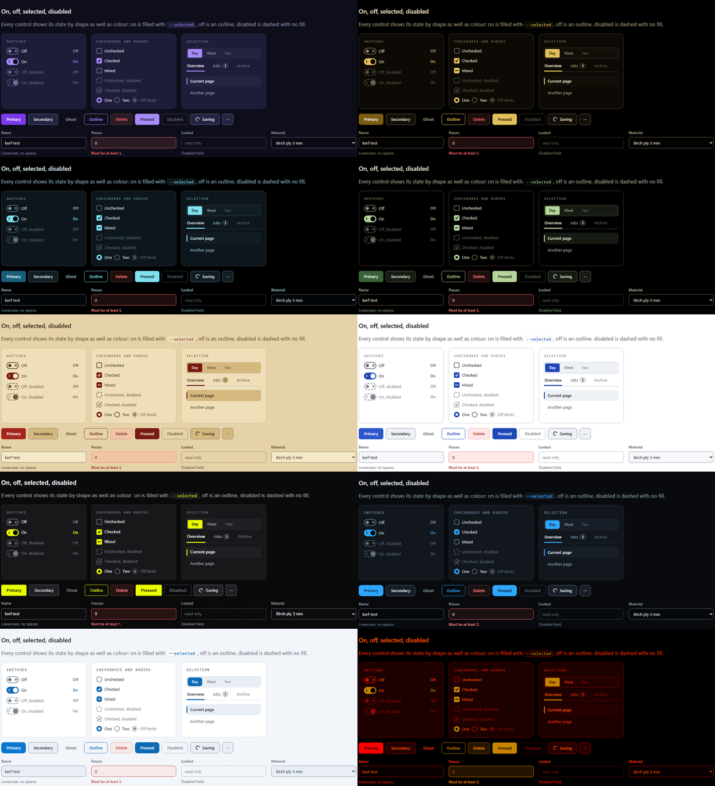

# Themes

Ten themes share one token contract, so any page built from the tokens works in all of them.
A theme is one CSS block, `[data-palette="<slug>"] { ... }`, that sets the tokens; Purple is
the base and is the absence of `data-palette`.

| Slug | Name | Ground | Set | |
|---|---|---|---|---|
| `purple` | Purple | dark | core | Violet accent and soft lavender text on deep indigo. The `:root` base. |
| `midnight-gold` | Midnight Gold | OLED | core | Warm gold on true black. |
| `glacier` | Glacier | OLED | core | Ice-blue text and signature on true black, deep teal accent. |
| `forest` | Forest | OLED | core | Pale sage and lichen with bark browns on true black. |
| `paper` | Paper | light | core | Warm parchment, ink-brown text, a serif for prose, red accent. |
| `daylight` | Daylight | light | core | Clean white with a blue accent. |
| `electric-yellow` | Electric Yellow | dark | opt-in | Acid yellow on graphite, tight radii, crisp strokes. |
| `laserlloyd` | LaserLloyd | dark | opt-in | Laser blue on near-black graphite, from the author's site. |
| `laserlloyd-light` | LaserLloyd Light | light | opt-in | The light partner of LaserLloyd. |
| `night-red` | Night Red | OLED | opt-in | Low blue light: ember text on true black, zero blue in any colour. |

- **Ground** decides `<html data-theme>`: `oled` gives `amoled`, `dark` gives `dark`, `light`
  gives `light`. OLED themes paint large surfaces true black, so an OLED panel leaves those
  pixels off.
- **Core** themes are what an app offers by default. **Opt-in** themes appear only when an app
  lists them in `data-themes`.
- **Families** pair a dark and a light theme (`laserlloyd` and `laserlloyd-light`). With
  `data-families="true"`, an element with `data-ui-theme-toggle` switches between them.

## Choosing themes for an app

The six core themes are a sensible default: two dark-on-colour, two true-black, two light.
With `data-default="auto"` a visitor whose OS is in light mode starts on the light default and
everyone else on the dark one, until they pick. Add `night-red` for apps used at night (a
bedside dashboard, a monitoring screen, an astronomy or music app). The brand themes
(`laserlloyd`, `laserlloyd-light`, `electric-yellow`) are examples of opt-in themes; forking
one is the quickest way to make your own brand theme.

## On, off, selected and disabled

Every theme uses the same control-state design, measured in every theme:

- **On, checked, pressed, current:** filled or marked with `--selected` (the theme's link
  colour), with `--on-selected` on it. It clears 3:1 on every surface; the label on it 4.5:1.
- **Off:** an outline in `--unselected-border` with a `--unselected-fg` knob or mark.
- **Disabled:** dashed, unfilled, in `--text-disabled`, even when on.

The accent is deliberately not the "on" colour. In themes with a dark accent (Glacier, Forest,
Purple) an accent "on" next to a grey "off" track measured 1.0 to 1.6:1, so the two states
differed mostly by the knob's position. The switch also carries a mark (a ring when off, a bar
when on) and an optional On/Off label, so its state reads in grayscale and for colour-blind
users.

## Night Red

A low-blue-light theme for a dark room and an OLED screen: warm red-orange text on true black,
red structure, and zero blue in any colour (`check_contrast.py` fails the build if one
appears).

It is not "everything pure red", the way astronomy night modes are, because that reads badly:

- **Pure red carries almost no luma** (54/255), and luma keeps glyph edges sharp. Remote-desktop
  and video coding halve chroma, and some OLED phones sample red on a sparse grid, so red-only
  text smears. It also tops out at 5.25:1, and APCA puts it at Lc 37.
- **Apps put real content in the lower text tiers,** and a flat ladder of three reds makes
  nothing stand forward.
- **Faint lines disappear** on a dimmed OLED, and with them every box.

So:

- **Text is an ember ladder.** Every tier adds some green, which restores luma; importance rises
  with heat and brightness:

  | Tier | Value | On black | Luma | APCA |
  |---|---|---|---|---|
  | primary | `#ff5800` | 6.65:1 | 117 | Lc 44 |
  | secondary | `#ff3000` | 5.68:1 | 88 | Lc 39 |
  | tertiary | `#f01c00` | 4.87:1 | 71 | Lc 34 |
  | disabled | `#960a00` | 2.34:1 | 39 | Lc 14 |

- **Red is the room:** surfaces, lines, tracks and the accent light only the red sub-pixel.
  Outlines sit at Midnight Gold's levels (`--border` 2.0:1, `--border-strong` 3.46:1).
- **Alerts move one step toward yellow,** because red is taken by the ground: danger is hot
  orange `#ff9000`, warning amber-yellow, info yellow-olive, success olive. Danger clears the
  red accent by 1.76:1 and dE00 26, so Delete never looks like Save.
- **On is amber, off is red:** controls that are on fill with the amber link colour and a black
  knob or tick; off controls are a red outline.
- **Images** marked `.ui-media` drop to a red monochrome through `--media-filter`.

Its contrast profile is `night`: text-primary 5.5:1 on every ground, secondary 4.5:1,
tertiary 4:1, disabled 2:1, bold prose 6:1, plus checks the standard profile does not need
(outlines against their surfaces, a visible surface step, a step between text tiers, colour
separation between the accent, danger and body text in CIEDE2000), an APCA report and the
zero-blue audit. Templates it follows: Apple Watch Ultra Night Mode, KStars "Night Vision",
N.I.N.A.'s night schema, and f.lux "Ember".

What it cannot change: photos and user-chosen colours keep their own colours unless marked
`.ui-media`, and text dimmed with opacity loses what the theme gained. Quiet decoration stays
quiet on purpose: skeleton bars, chart grid lines and the scrim behind a dialog are close to
invisible, as a night screen should be.

## Forest

An earthy theme built like Glacier, with pale green and browns where Glacier has pale blue:
true black wherever a pane is big (page, nav, cards, wells, code), lines carrying the
structure instead; pale sage text stepping down to moss grey (16.8, 10.6 and 7.5:1 on black);
one signature, soft lichen `#b5d59b`, for links, focus and highlights; a deep moss accent plate
with a white label; browns for borders, the user's chat bubbles, italics and scrollbars; and
Glacier's clear status set.

## Paper

The one core theme with a real serif: `--font-serif` is a Charter/Georgia stack, meant for
long-form prose and quotes; headings stay on the sans. Its surface ramp darkens as it rises,
like stacked paper, so keep secondary and status text off the two darkest steps
(`--surface-3`, `--surface-4`) where you can.

## Printing and high contrast

Paper is light, so when a page is printed in a dark theme the runtime switches to a light one
for the print (the family's light partner, else the first light theme the app offers, else
Daylight) and switches back afterwards; `data-print-theme` picks another slug, or `none` keeps
the screen theme. The component layer hides navigation, toasts and tooltips in print.

When the system asks for more contrast (`prefers-contrast: more`), every theme raises its
lines and dividers to the control-edge strength and its tertiary text to the secondary tier.

## Making your own theme

1. Copy [`theme-template.css`](theme-template.css) (every token, with Purple's values) to
   `src/css/theme-<slug>.css` and set `[data-palette="<slug>"]`.
2. Change the values. Keep every token; leave the `var()` ones (control states, code chrome)
   unless their checks fail.
3. Add an entry to `src/themes.json` (see [`CONTRIBUTING.md`](../CONTRIBUTING.md)).
4. Run `python tools/check_contrast.py --theme <slug> --fail-on any` until it passes, then
   `python tools/sync_theme.py build` and look at it in the specimen.

A theme only for your own app can also live in the app: a stylesheet loaded after
`ui-theme.css` with one `[data-palette="mybrand"]` block. The runtime only offers slugs it
knows, so for a picker entry the theme belongs in the registry; fork the repository for that.
